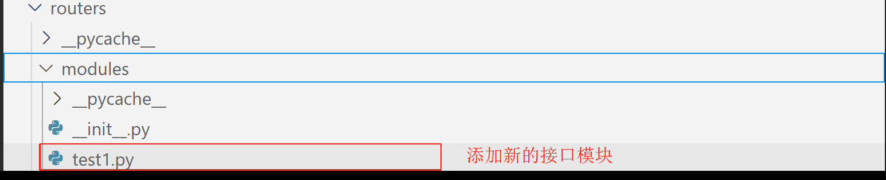
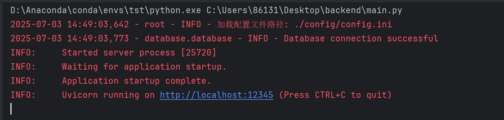
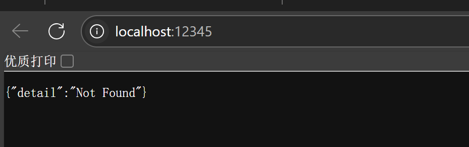
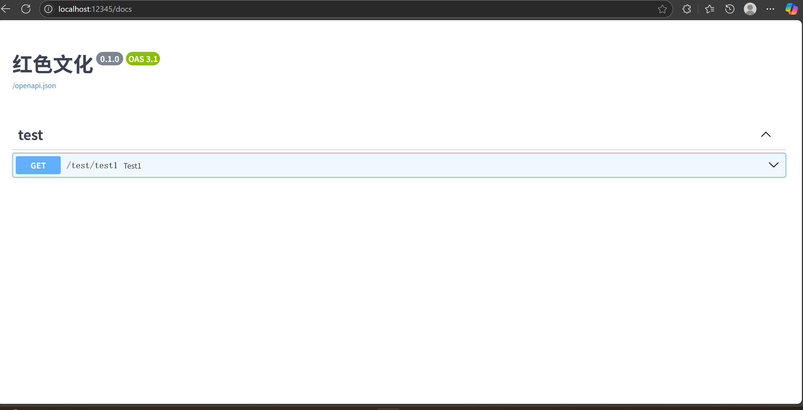

# 该项目后端开发指南

## 一、项目总体开发介绍

为了开发快捷，后端使用fastapi作为基本架构，在开发前用conda创建好环境后，使用`pip install -r requirements.txt -i https://pypi.tuna.tsinghua.edu.cn/simple`下载项目所需要的库，主要有以下几个基本模块（与目录对应）：

1、 config：项目配置目录，里面有.ini文件作为配置文件格式如下:

```ini
[mysql] # MySQL 数据库连接配置
host = localhost
port = 3306
user = fsx
password = 123456
database = test

[cors]  # CORS 中间键配置
allow_origins = ["*"]
allow_credentials = True
allow_methods = ["*"]
allow_headers = ["*"]

[server]  # 服务端配置
host = localhost
port = 12345
img_path = database/profile/image
video_path = database/profile/video
```

2、 database：数据管理模块，其目录如下：

```c
crud   // 用来写对数据库中数据增删改查操作的代码
profile  // 保存项目静态文件的部分如：照片、视频等静态资源
schemas // 保存前端与数据库交互的请求的相关类
database.py // 进行数据库连接和获取数据库连接的依赖操作的代码，不用修改，通过改配置文件就可以连接mysql数据库
models.py // 在连接的数据库声明定义表操作，可以通过python代码创建定义表以及表之间的关系
__init__.py // 包初始化文件，不需要修改
```

3、 routers：写前后端接口模块，为了方便开发互不干扰，里面有一个modules模块，在这里面进行前后端端接口的功能添加即可，示例：

①在modules中创建一个test1.py文件，作为test模块接口部分



 ②使用fastapi库实现接口部分代码如下：

```python
from fastapi import Depends, APIRouter, HTTPException, status, FastAPI
from fastapi.security import OAuth2PasswordRequestForm
from sqlalchemy.orm import Session

from database import crud

'''
在下面代码的参数中：
prefix：表示该模块父路径，其下面的子路径会直接与该路径拼接
tags：表示该模型标题，会在docs中显示
'''
router = APIRouter(prefix="/test", tags=["test"])

@router.get("/test1")
def test1():
    return {"message": "test1"}
```

③在modules目录中 `__init__.py`文件中将上述创建test模块导出代码如下：

```python
from . import test1 # 其中如果有新添加的模块，直接在后用“，添加文件名即可”如：
from . import (
              test1,
              test2,
)
```

④进入`router.py`文件中，导入刚才新创建的test1模块路由如下：

```python
# 导入模块路由，其中 as 表示把导入模块路由换个别名，方便后面代码区分
from routers.modules.test1 import router as test_router
```

⑤在`Route`类中找到下面类似这行的代码进行添加新的模块路由：

```python
# ---------------------------添加模块路由---------------------------
        self.app.include_router(test_router)
```

⑥这样便将新新的路由模块放到项目中，然后运行`main.py`函数即可将项目运行：

⑦在运行后，为了方便测试，用浏览器打开后端运行路径：`http://localhost:12345`显示如下图：
⑧将路径替换为`(http://localhost:12345/docs)`<就是在原来的根目录添加`/docs`>就会显示下面文档页面<里面是当前后端运行的全部可用接口，你可以进行测试是否好用，同时也可以方便前端接口函数的实现>：
